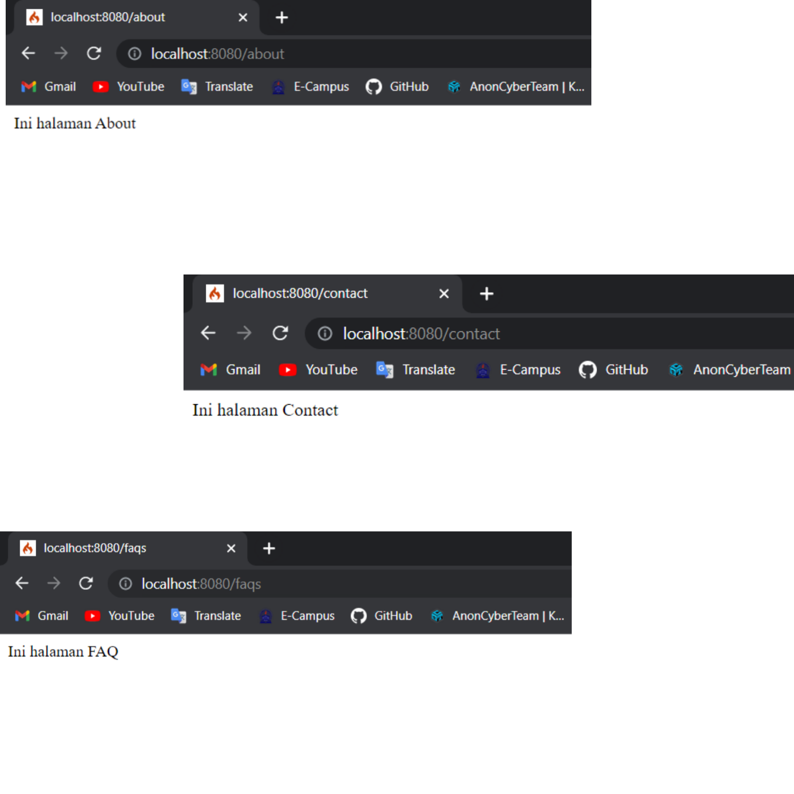

# lab7web
# Tugas Pemograman Web 2
## Profil
| #               | Biodata           |
| --------------- | ----------------- |
| **Nama**        | Zhafira A. K      |
| **NIM**         | 312110067         |
| **Kelas**       | TI.21.A.1         |
| **Mata Kuliah** | Pemrograman Web 2 |

# Codeigniter 4

<p align="center">
 
</p>

<p>
CodeIgniter adalah sebuah framework PHP yang digunakan untuk membangun aplikasi web. Framework ini dikembangkan dengan tujuan untuk memudahkan proses pengembangan aplikasi web dengan menggunakan PHP. CodeIgniter memiliki banyak fitur yang memudahkan pengembang dalam membangun aplikasi web seperti sistem routing, pembuatan kueri database, dan juga pembuatan tampilan menggunakan template.</p>

# Daftar Isi

| **Daftar isi**                                                                                                           |
| ------------------------------------------------------------------------------------------------------------------------ |
| [Langkah-langkah & Persiapan](https://github.com/kyuurazz/Lab7Web#langkah-langkah--persiapan)                            |
| [Instalasi](https://github.com/kyuurazz/Lab7Web#instalasi-codeigniter-4-ci)                                              |
| [Routing & Controller](https://github.com/kyuurazz/Lab7Web#routing--controller)                 |
| [Membuat Layout Web dengan CSS](https://github.com/kyuurazz/Lab7Web#membuat-layout-web-dengan-css) |
| [Pertanyaan & Tugas](https://github.com/kyuurazz/Lab7Web#pertanyaan-dan-tugas) |

# Langkah-langkah & Persiapan
<p>Sebelum memulai menggunakan Framework Codeigniter, perlu dilakukan konfigurasi pada webserver.
Beberapa ekstensi PHP perlu diaktifkan untuk kebutuhan pengembangan Codeigniter 4.
Berikut beberapa ekstensi yang perlu diaktifkan:</p>
- php-json ekstension untuk bekerja dengan JSON;
- php-mysqlnd native driver untuk MySQL;
- php-xml ekstension untuk bekerja dengan XML;
- php-intl ekstensi untuk membuat aplikasi multibahasa;
- libcurl (opsional);

<p>Untuk mengaktifkan ekstensi tersebut, pergi ke XAMPP Control Panel pada bagian Apache klik Config
-> PHP.ini</p>


<p>Pada bagian extention, hilangkan tanda ; (titik koma) pada ekstensi yang akan diaktifkan. Kemudian
simpan kembali filenya dan restart Apache web server.</p>


# Instalasi Codeigniter 4 (CI)
## Manual
<p>Untuk melakukan instalasi Codeigniter 4 dapat dilakukan dengan dua cara, yaitu cara manual dan
menggunakan composer. Yang pertama kita akan menggunakan cara manual.</p>

1. Buka situs web resmi CodeIgniter 4 di https://codeigniter.com dan klik tombol "Download" di menu atas. Pilih versi terbaru dari CodeIgniter 4 yang tersedia untuk diunduh.
2. Setelah selesai mengunduh, ekstrak file yang diunduh ke dalam direktori project kita (Example: htdocs/lab7_php_ci).
3. Ubah nama direktory framework-4.x.xx menjadi ci4.
3. Di dalam direktori ci4, ubah nama file `env` menjadi `.env` kemudian buka file tersebut dan ubah nilai variable
CI_ENVIRONMENT menjadi development. Dan kita dapat menyesuaikan pengaturan seperti database dan konfigurasi lainnya. Pastikan untuk menyimpan file setelah melakukan perubahan.


4. Kemudian, buka browser dengan alamat http://localhost/lab7_php_ci/ci4/public/


## Composer
<p>Untuk melakukan instalasi menggunakan composer pastikan bahwa composer sudah terinstal di komputer kita. Jika belum, unduh composer dari situs web resmi di https://getcomposer.org/ dan ikuti petunjuk instalasi.</p>

1. Buka terminal atau command prompt pada komputer kita.
2. Buat direktori baru untuk proyek CodeIgniter kita dan masuk ke dalamnya.
3. Jalankan perintah Composer untuk menginstal CodeIgniter 4:
```bash
composer create-project codeigniter4/appstarter lab7_php_ci
```
4. Tunggu sampai proses instalasi selesai. Composer akan mengunduh dan menginstal semua dependensi dan paket yang diperlukan oleh CodeIgniter 4.
5. Setelah proses instalasi selesai, masuk ke direktori proyek kita dan jalankan server pengembangan dengan perintah berikut:
```php
php spark serve
```


6. Buka Web browser dan buka alamat localhost:8080. Jika semuanya berjalan dengan lancar, Maka tampilannya akan sama dengan gambar sebelumnya.

# Routing & Controller
<p>Pada CodeIgniter, routing digunakan untuk menentukan controller mana yang akan menangani request. Controller sendiri adalah sebuah kelas atau script yang bertanggung jawab untuk merespon request tersebut. Dalam CodeIgniter, request yang diterima oleh file index.php akan diteruskan ke Router dan kemudian diarahkan ke Controller yang sesuai.</p>
<p>Router terletak pada file app/config/Routes.php</p>


### Membuat Routes Baru
- Tambahkan kode berikut ke dalam Routes.php

```php
$routes->get('/about', 'Page::about');
$routes->get('/contact', 'Page::contact');
$routes->get('/faqs', 'Page::faqs');
```


- Untuk mengetahui route yang ditambahkan sudah benar, buka CLI dan jalankan perintah berikut.

```php
php spark routes
```


- Selanjutnya coba akses route yang telah dibuat dengan mengakses alamat http://localhost:8080/about


<p>Ketika diakses akan mucul tampilan error 404 file not found, itu artinya file/page tersebut tidak ada.
Untuk dapat mengakses halaman tersebut, harus dibuat terlebih dahulu Contoller yang sesuai dengan
routing yang dibuat yaitu Contoller Page.</p>

### Membuat Controller Page
- Selanjutnya adalah membuat Controller Page. Buat file baru dengan nama page.php pada direktori
Controller kemudian isi kodenya seperti berikut.

```php
<?php
namespace App\Controllers;
class Page extends BaseController
{
  public function about()
  {
    echo "Ini halaman About";
  }
  public function contact()
  {
    echo "Ini halaman Contact";
  }
  public function faqs()
  {
    echo "Ini halaman FAQ";
  }
}
```

- Selanjutnya refresh kembali web browser, maka akan ditampilkan hasilnya yaitu halaman sudah dapat
diakses.



### Auto Routing
- Secara default fitur autoroute pada Codeiginiter sudah aktif. Untuk mengubah status autoroute dapat
mengubah nilai variabelnya. Untuk menonaktifkan ubah nilai `true` menjadi `false`.

```php
$routes->setAutoRoute(true);
```

- Tambahkan method baru pada Controller Page seperti berikut.

```php
public function tos()
{
  echo "ini halaman Term of Services";
}
```

- Method ini belum ada pada routing, sehingga cara mengaksesnya dengan menggunakan alamat: http://localhost:8080/page/tos


### Membuat View
- Selanjutnya dalam membuat view untuk tampilan web agar lebih menarik. Buat file baru dengan
nama about.php pada direktori view (app/view/about.php) kemudian isi kodenya seperti berikut.

```php
<?= $this->include('template/header'); ?>
  <div class="content">
    <h1><?= $title; ?></h1>
    <hr>
    <p><?= $content; ?></p>
  </div>
<?= $this->include('template/footer'); ?>
```

- Ubah method about pada class Controller Page menjadi seperti berikut:

```php
public function about()
{
  return view('about', [
    'title' => 'Halaman About',
    'content' => 'Ini adalah halaman abaut yang menjelaskan tentang isi halaman ini.'
  ]);
}
```

- Kemudian lakukan refresh pada halaman web tersebut.


# Membuat Layout Web dengan CSS
<p>Pada dasarnya layout web dengan css dapat diimplamentasikan dengan mudah pada Codeigniter. Yang
perlu diketahui pada Codeigniter 4 adalah file yang menyimpan asset css dan javascript terletak pada
direktori public.</p>

- Buat file CSS pada direktori public dengan nama `style.css`.


- Kemudian buat folder `template` pada direktori view. lalu buat file baru dengan nama `header.php` dan `footer.php`.

- Lalu, masukan kode berikut ke dalam file app/view/template/header.php

```php
<!DOCTYPE html>
<html lang="en">
<head>
  <meta charset="UTF-8">
  <title><?= $title; ?></title>
  <link rel="stylesheet" href="<?= base_url('/style.css'); ?>">
</head>
<body>
  <div id="container">
    <div class="header">
      <h1>Layout Sederhana</h1>
    </div>
    <nav>
      <a href="<?= base_url('/'); ?>">Home</a>
      <a href="<?= base_url('/artikel'); ?>">Artikel</a>
      <a href="<?= base_url('/about'); ?>">About</a>
      <a href="<?= base_url('/contact'); ?>">Kontak</a>
    </nav>
```

- Dan masukan juga kode berikut ke dalam file app/view/template/footer.php

```php
<section id="wrapper">
  <section id="main">
  </section>
  <aside id="sidebar">
    <div class="widget-box">
      <h3 class="title">Widget Header</h3>
      <ul>
        <li><a href="#">Widget Link</a></li>
        <li><a href="#">Widget Link</a></li>
      </ul>
    </div>
    <div class="widget-box">
      <h3 class="title">Widget Text</h3>
      <p>
        Lorem ipsum dolor sit amet consectetur adipisicing elit. Iste nemo pariatur vitae obcaecati nam in ipsa, optio nesciunt ducimus eos doloribus minus sequi, quae placeat fuga?
      </p>
    </div>
  </aside>
</section>
<footer>
  <p>&copy; 2023 - Universitas Pelita Bangsa</p>
</footer>
</div>
</body>
</html>
```

- Kemudian, ubah file app/view/about.php seperti berikut.

```php
<?= $this->include('template/header'); ?>
  <div class="content">
    <h1><?= $title; ?></h1>
    <hr>
    <p><?= $content; ?></p>
  </div>
<?= $this->include('template/footer'); ?>
```

- Tambahkan kode CSS untuk mempercantik tampilannya, dengan menambahkan kode berikut ke dalam file `style.css`.

```css
body {
  font-family: Arial, sans-serif;
  margin: 0;
  padding: 0;
}

/* Container */
#container {
  width: 980px;
  margin: 0 auto;
  box-shadow: 0 0 1em #cccccc;
}

/* Header */
.header {
  padding: 20px;
  color: #b5b5b5;
}

/* Navigation */
nav {
  display: block;
  background-color: #1f5faa;
}

nav a {
  display: inline-block;
  padding: 20px 30px;
  color: #ffffff;
  font-size: 14px;
  font-weight: bold;
  text-decoration: none;
}

nav a.active,
nav a:hover {
  background-color: #2b83ea;
}

/* Wrapper */
#wrapper {
  display: flex;
  flex-wrap: wrap;
  justify-content: flex-end;
  margin: 20px;
}

/* Main Content */
#main {
  flex-basis: 65%;
  margin-right: 10px;
}

/* Sidebar */
#sidebar {
  float: left;
  width: 100%;
  padding: 20px;
}

/* Widget */
.widget-box {
  border: 1px solid #eee;
  margin-bottom: 20px;
}

.widget-box h3.title {
  margin: 0;
  padding: 15px 16px;
  background-color: #428bca;
  color: #fff;
}

.widget-box ul {
  margin: 0;
  padding-left: 0;
  list-style: none;
}

.widget-box li {
  border-bottom: 1px solid #eee;
}

.widget-box li a {
  display: block;
  padding: 10px 16px;
  color: #333;
  text-decoration: none;
}

.widget-box li:hover a {
  background-color: #eee;
}

.widget-box p {
  padding: 0 15px;
  line-height: 25px;
}

/* Footer */
footer {
  background-color: rgb(40, 40, 40);
  color: #fff;
  padding: 5px;
  text-align: center;
}

/* Content */
.content {
  padding: 10px 20px;
  float: left;
  width: 65%;
  flex-basis: 100%;
}
```

- Selanjutnya refresh halaman web pada alamat: http://localhost:8080/about

# Pertanyaan dan Tugas
<p>Lengkapi kode program untuk menu lainnya yang ada pada Controller Page, sehingga semua link pada
navigasi header dapat menampilkan tampilan dengan layout yang sama.</p>

- Output


## Terima Kasih!
